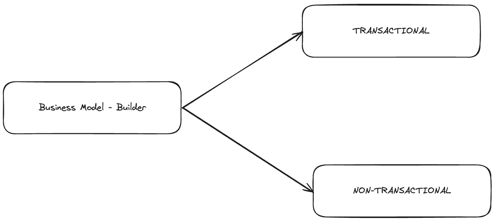

# 💰 Monetization

Welcome to the monetization section! In the evolving landscape of decentralized applications (DApps), developers seek innovative ways to monetize their creations while providing value and utility to end users. Our development tools are designed to support builders in this journey, offering flexibility and efficiency in integrating monetization strategies into their DApps. Two distinct business models have emerged as predominant ways to achieve this: the Transactional Model and the Non-Transactional Model.

## Models

### Transactional Model: Engaging Users with On-Protocol Transactions

The transactional model revolves around direct user engagement with the iExec protocol. In this model, end users actively participate by signing transactions, thereby interacting with the DApp in a dynamic and transaction-based manner. By signing transactions, users can directly validate operation and get outcome of the DApp, leading to a transparent and trustless ecosystem where every action is recorded on the blockchain.

### Non-Transactional Model: Streamlining User Experience

Contrastingly, the non-transactional model simplifies the user experience by minimizing direct interactions with the protocol during the app's usage. Here, end users have the option to pre-provide assets (optionally) and enjoy the benefits of the DApp without the need for ongoing payable transactions. This model is particularly suited for scenarios where users seek to benefit from the application's offerings without the complexity of managing payable transactions.

Each monetization model has two sub-models. Choose the one that best suits your needs.

