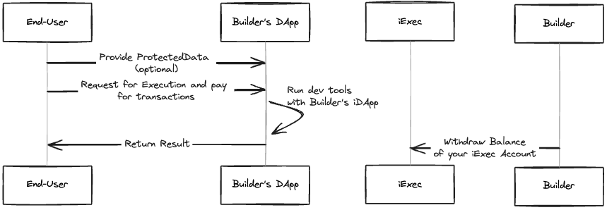
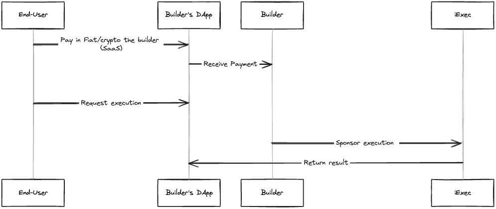

# 💰 Monetize Your DApp

## How to implement one of these models ?

### Transactional

#### Pay-per-use



As a builder, follow these steps:

1. **Develop Your Customized Tee iDApp (iExec Tee DApp)**: Begin by creating your tailored Tee iDApp. This ensures that your decentralized application leverages the secure enclave technology provided by iExec.

2. **Choose the Corresponding Dev Tools and Instantiate Your Own iDApp**: Select the appropriate dev tools for your project, such as web3mail. Instantiate your iDApp within your chosen dev environment. For instance, with web3mail, you can do this using the following JavaScript code:

```js
new IExecWeb3mail(ethProvider, {
  DAppAddressOrENS: "Your_iDapp_Address_Or_iDapp_ENS",
});
```

3. **Integrate Your Chosen Dev Tool into Your DApp**: Incorporate the selected dev tool, ensuring seamless integration with your Tee iDApp. This step ensures that your DApp leverages the functionalities provided by the dev tool to enhance its capabilities and user experience.

4. **Withdraw Earnings from iExec Account**: As end-users use you DApp to run your iDApp, earnings accumulate in your iExec account. Periodically withdraw these earnings to monetize your efforts effectively.

### Non-Transactional

#### Custom



As a builder, follow these steps:

1. **Develop Your Customized Tee iDApp**: Begin by creating your tailored Tee iDApp, leveraging the iExec infrastructure to ensure secure and efficient execution of tasks within a trusted environment.

2. **Establish DApp as a Service (SaaS) Portal**: Integrate your Tee iDApp into a service portal, allowing end-users to access its functionalities through a Service (SaaS) model. You can enable payments in both fiat and cryptocurrency, providing flexibility to users, while earning a margin from each transaction conducted through your portal.

3. **Sponsor End-User Transactions**: Utilize your chosen dev tools to sponsor end-user transactions, setting up end-user as beneficiary. By covering the costs associated with transactions, you incentivize users to engage with your Tee iDApp, thereby driving adoption and usage.

4. **Withdraw Earnings from iExec Account**: As end-users use you DApp to run your iDApp, earnings accumulate in your iExec account. Periodically withdraw these earnings to monetize your efforts effectively.
