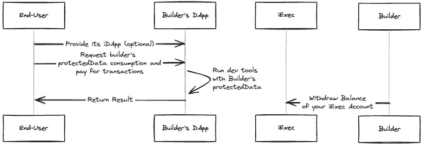
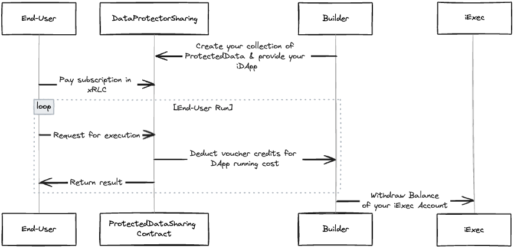

# 💰 Monetize Your DApp

## How to implement one of these models ?

### Transactional

#### Pay-per-use

As a builder, follow these steps:

1. **Provide ProtectedData for End-Users**: Begin by offering protectedData to end-users, ensuring the security and integrity of the data provided.

2. **Select Corresponding Dev Tools for Consuming ProtectedData**: Choose the appropriate dev tools that will enable end-users to consume the protectedData effectively. Ensure compatibility and seamless integration with your chosen protectedData format.

3. **Integrate Chosen Dev Tool into Your DApp**: Incorporate the selected dev tool into your decentralized application (DApp), facilitating the smooth consumption of protectedData by end-users. Ensure that the integration enhances the functionality and user experience of your DApp.

4. **Withdraw Earnings from iExec Account**: As end-users consume your protectedData, earnings accumulate in your iExec account. Periodically withdraw these earnings to monetize your efforts effectively.

#### Subscription

⚠️ This monetization model is exclusive to DataProtectorSharing dev tools.

As a builder, follow these steps:

1. **Create Your Protected Data Collection**: Utilize our tools to create a collection of protected data. Provide an iDApp (iExec tee DApp) allowing end-users to access and consume this protectedData securely.

2. **Set Subscription Price & Duration**: Define the pricing and duration for subscriptions to your protectedData collection(s). This step enables you to monetize access to your valuable data securely.

3. **Enjoy Profits**: Once your data collection is live and subscriptions are active, sit back and enjoy the profits. Easily withdraw your earnings from your iExec account hassle-free.

### Non-Transactional

#### Custom

As a builder, follow these steps:

1. **Provide Your ProtectedData**: Begin by creating a set of ProtectedData. Use DataProtectorSharing dev tools can enable you to create a collection of ProtectedData easier to manage but it's not mandatory.

2. **Establish ProtectedData as a Service (SaaS) Portal**: Integrate your set of ProtectedData into a service portal. This enables end-users to securely access and utilize the protected data via your portal. Offer payment options in fiat and cryptocurrency, providing users with flexibility while earning a margin from each transaction conducted through your platform.

3. **Sponsor End-User Transactions**: Utilize your chosen dev tools to sponsor end-user transactions, setting up end-user as beneficiary. By covering the costs associated with transactions, you incentivize users to engage with your protectedData, thereby driving adoption and usage.

4. **Withdraw Earnings from iExec Account**: As end-users consume your protectedData, earnings accumulate in your iExec account. Periodically withdraw these earnings to monetize your efforts effectively.
