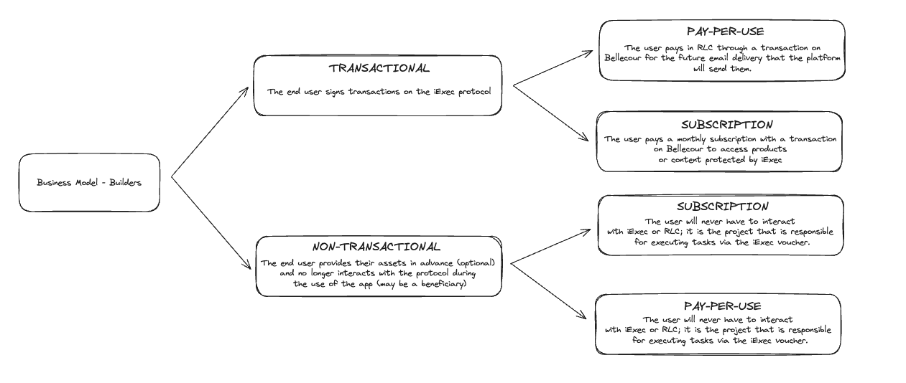
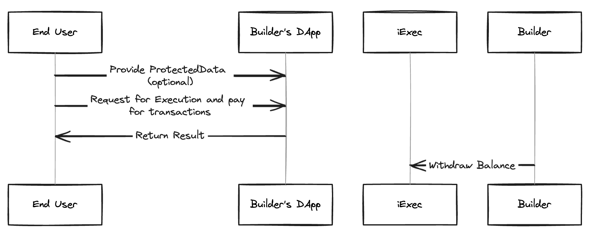
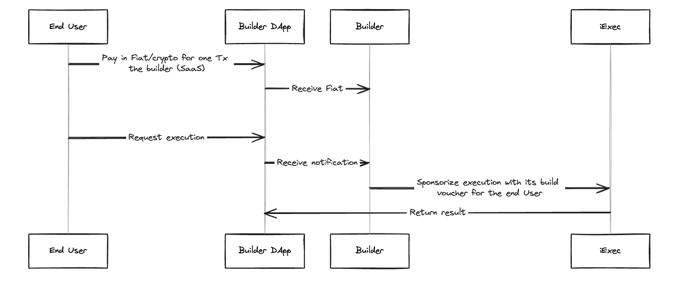

# 💰 Monetize Your DApp

## Models

In the evolving landscape of decentralized applications (DApps), developers seek innovative ways to monetize their creations while providing value and utility to end users. Our development tools are designed to support builders in this journey, offering flexibility and efficiency in integrating monetization strategies into their DApps. Two distinct business models have emerged as predominant ways to achieve this: the Transactional Model and the Non-Transactional Model.

### Transactional Model: Engaging Users with On-Protocol Transactions

The transactional model revolves around direct user engagement with the iExec protocol. In this model, end users actively participate by signing transactions, thereby interacting with the DApp in a dynamic and transaction-based manner. By signing transactions, users can directly validate operation and get outcome of the DApp, leading to a transparent and trustless ecosystem where every action is recorded on the blockchain.

### Non-Transactional Model: Streamlining User Experience

Contrastingly, the non-transactional model simplifies the user experience by minimizing direct interactions with the protocol during the app's usage. Here, end users have the option to pre-provide assets (optionally) and enjoy the benefits of the DApp without the need for ongoing payable transactions. This model is particularly suited for scenarios where users seek to benefit from the application's offerings without the complexity of managing payable transactions.

Each monetization model has two sub-models. Choose the one that best suits your needs.



## How to implement one of those models ?

### Transactional

#### Pay-per-use



As a builder you should do those steps :

1 - Build your own tee DApp

2 - Choose the corresponding dev tools and set your own DApp

For example with web3mail:

```js
new IExecWeb3mail(ethProvider, {
  DAppAddressOrENS: "web3mail.apps.iexec.eth",
});
```

3 - Integrate your chosen dev tool into your front end

#### Subscription


As a builder you should do those steps :

1 - Build your own tee DApp
2 - Choose the dataprotector-v2 dev tools and set your own DApp to enable people to consume their ProtectedData.
3 - Integrate dataprotector-v2 dev tool into your front end

### Non-Transactional

#### Pay-per-use



As a builder you should do those steps :

1 - Build your own tee DApp
2 - Set up your SaaS portal to receive Fiat or crypto payment
3 - Sponsorize end user execution and set up end user as beneficiary

#### Subscription


As a builder you should do those steps :

1 - Build your own tee DApp
2 - Set up your SaaS portal to receive Fiat or crypto payment
3 - Sponsorize end user execution and set up him as beneficiary
